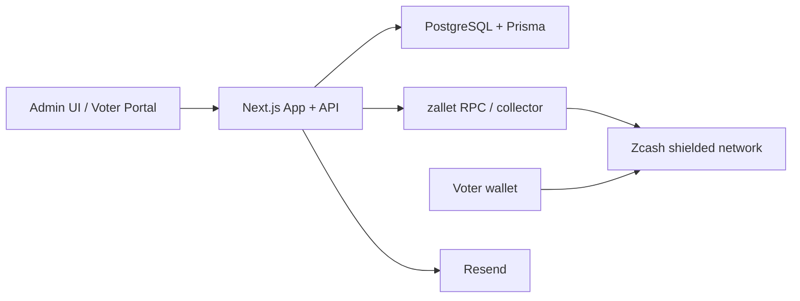
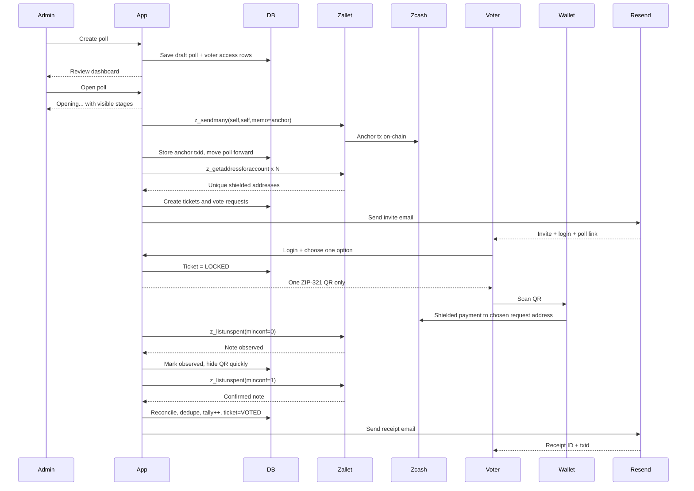

# community-shielded-voting

Reference implementation of invite-based shielded voting on Zcash.

This project packages a working community voting system with:
- admin poll creation and review
- guided `Open poll` flow with visible stages
- temporary poll-scoped voter credentials
- single locked QR voting via ZIP-321
- one-block vote receipt delivery
- public reconciled poll board
- duplicate protection in the vote tally

It is designed as a **community pilot rail** and **reference implementation**, not as a final trustless voting primitive.

## Current State

- Working web app built with Next.js, Prisma, and PostgreSQL
- Zcash shielded vote transport through `zallet`
- Public board with reconciled percentages only
- Admin dashboard with voter completion and delivery controls
- End-to-end flow exercised in a live deployment with team-run tests

## Product Flow

### Admin
- Create a poll in a review-first form
- Review question, answers, voter table, and poll window
- Use one primary action: `Open poll`
- Watch opening stages:
  - `Anchor rail`
  - `Issue tickets`
  - `Send invites`
  - `Open poll`

### Voter
- Receive an invite email with poll-scoped credentials
- Sign in to the poll
- Choose one option before any QR is shown
- Confirm the choice and receive one locked QR only
- Pay through a shielded wallet flow
- Receive a receipt after one on-chain confirmation

### Public
- View only OPEN polls
- See poll question, poll ID, and reconciled percentages
- No public direct-vote entry from the board

## Architecture



## End-to-End Voting Flow



## Zcash-Specific Usage

- `z_sendmany` anchors each poll on-chain
- `z_getaddressforaccount` allocates unique shielded destinations for vote requests
- `z_listunspent(minconf=0)` detects incoming notes quickly to hide the QR
- `z_listunspent(minconf=1)` confirms the vote and triggers reconciliation
- ZIP-321 encodes the wallet request for the voter QR flow

More detail:
- [Architecture](./docs/architecture.md)
- [Zcash Flow](./docs/zcash-flow.md)
- [Privacy Model](./docs/privacy-model.md)
- [Threat Model](./docs/threat-model.md)
- [Deployment](./docs/deployment.md)
- [Demo Guide](./docs/demo.md)
- [ZAL proposal draft](./docs/community-shielded-voting-zal-proposal.md)

## Trust Model

This project currently offers:
- strong privacy against public observers
- good privacy against the normal admin UI
- shielded transport of the vote on Zcash

It does **not yet** provide:
- trustless public tally verification
- anonymous membership proofs
- full privacy hardening against a privileged operator with DB + collector access

Those are follow-on roadmap items, not part of the current reference implementation.

## Local Setup

1. Copy the environment template:

```bash
cp .env.example .env.local
```

2. Install dependencies:

```bash
npm install
```

3. Create the database schema:

```bash
npx prisma migrate dev
```

4. Start the app:

```bash
npm run dev
```

## Environment

- `DATABASE_URL` for PostgreSQL
- `ZCAP_SESSION_SECRET` for browser session signing
- `ZCAP_INTERNAL_SECRET` for internal collector routes
- `ZALLET_*` and `POLL_COLLECTOR_ACCOUNT_UUID` for the collector wallet
- `RESEND_API_KEY` and `RESEND_FROM_EMAIL` for invite and receipt delivery

See `.env.example` for the base local shape.

## Seeding an Admin

Create the initial admin explicitly:

```bash
SEED_ADMIN_PASSWORD='replace-with-a-long-random-password' npm run db:seed
```

Optional overrides:

```bash
SEED_ADMIN_NICK='operations-admin' \
SEED_ADMIN_EMAIL='ops@example.com' \
SEED_ADMIN_PASSWORD='replace-with-a-long-random-password' \
npm run db:seed
```

The seed script does not overwrite existing passwords.

## License

Apache-2.0
