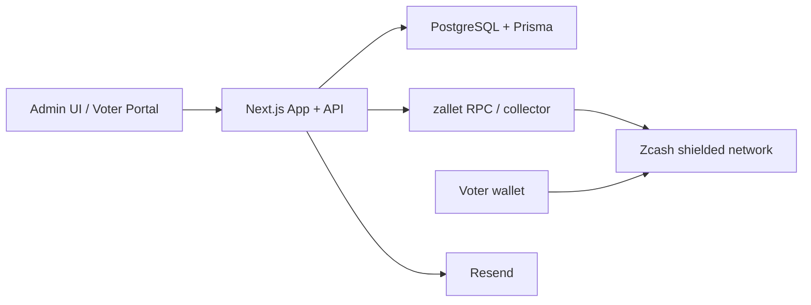

# Architecture

## System Components

## Layers

### App layer
- Next.js UI
- API routes for admin, auth, polls, voting, and reconcile
- ZIP-321 QR generation
- invite and receipt email orchestration

### State layer
- Polls
- Voter access records
- Ticket assignments
- Vote requests
- Receipts
- Reconciled tally

### Collector layer
- `zallet` RPC
- shielded address generation
- incoming note observation
- anchor transaction submission

### Zcash layer
- shielded transfer transport
- anchor transaction persistence
- one-block confirmation used for receipt finalization

## Core Product Separation

- **Admin dashboard** manages poll lifecycle, voter rows, delivery, and results
- **Voter portal** handles invite login, answer choice, QR locking, and receipt status
- **Public board** shows only reconciled results for OPEN polls
