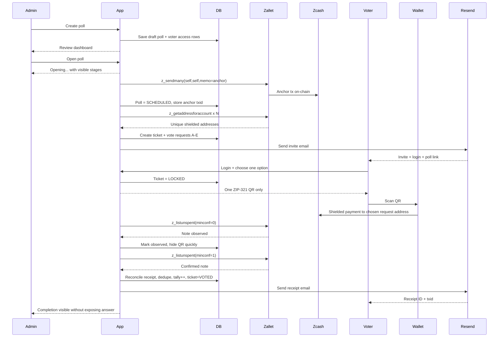
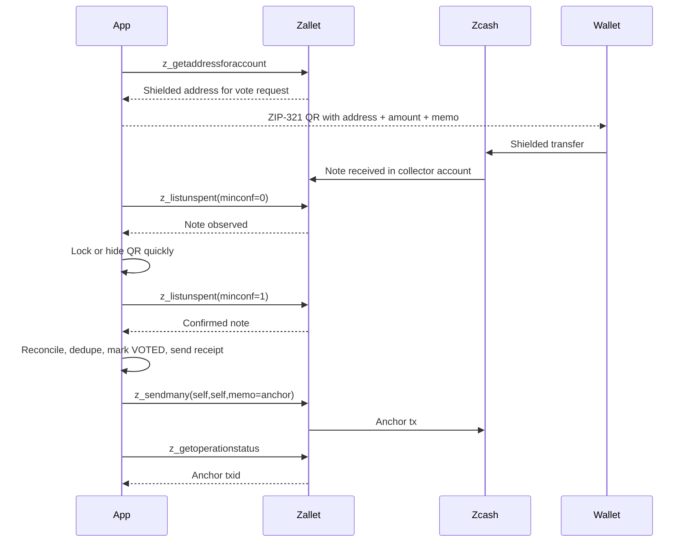

# community-shielded-voting

Draft Sprint Proposal for [ZcashApplicationsLab/lab](https://github.com/ZcashApplicationsLab/lab), aligned to **Vertical 6: Private Voting & DAO Governance**.

## Issue Draft

**Sprint name**  
community-shielded-voting

**Vertical**  
Private Voting & DAO Governance

**Problem**  
Zcash has strong privacy primitives, but there is still no simple reference implementation for invite-based community voting that ordinary users can actually run with a wallet. Small communities, pilots, and DAO-style groups need a working flow for private vote transport, duplicate protection, voter receipts, and a clean admin surface without exposing the selected option to the operator UI.

**Deliverable**  
Document, harden, and present an already working Apache-licensed reference implementation of invite-based shielded voting on Zcash: admin poll creation and opening flow, temporary voter credentials, single locked QR voting, public reconciled tally, duplicate protection, one-block vote receipt delivery, deployment guide, threat model, demo, and final sprint writeup.

**Team**  
- Lead: `@Michae2xl`  
  Builder of the current working prototype, with direct implementation experience across the app, poll flow, Zcash integration, deployment, and UX iteration.  
- Contributors: open to additional reviewer and contributor support during the sprint.  
- Commitment: 10 to 20 hours per week.

**Sprint length**  
3 weeks

**Planned start date**  
2026-04-28

## Current status

- Live production deployment already running
- End-to-end flow already tested with team members
- Poll creation, opening, invite delivery, login, QR vote flow, duplicate protection, and receipt email already working
- Public poll board and admin dashboard already running in production

This sprint is not about moving from idea to prototype. It is about taking a working live system and turning it into a well-documented, reviewable, reusable Lab reference implementation.

## Current product flow

### Admin flow
- `Create poll` opens a review-first dashboard, not a raw operational form
- The admin defines:
  - question
  - visible answers
  - voter table
  - poll window
- The review screen uses one primary action: `Open poll`
- `Open poll` shows visible execution stages:
  - `Anchor rail`
  - `Issue tickets`
  - `Send invites`
  - `Open poll`
- After opening, the admin works through a modular dashboard:
  - `Summary`
  - `Voters`
  - `Delivery`
  - `Results`

### Voter flow
- The voter receives an invite email with poll-scoped credentials
- The invite leads into the login flow for that poll
- The voter chooses one answer before any QR is generated
- After confirmation, the ticket locks and the portal shows one QR only
- If the voter leaves and returns, the same locked QR remains available
- When the note is observed, the QR disappears quickly
- After one on-chain confirmation, the vote is reconciled and the voter receives a receipt by email

### Public board flow
- `/polls` is public and read-only
- It shows only OPEN polls
- It displays:
  - poll question
  - poll ID
  - reconciled valid-vote percentages
- It does not expose direct voting entry or collector-raw duplicate counts

**Primitives and dependencies**  
- Zcash shielded transfers as the vote transport rail  
- `z_sendmany` for poll anchoring  
- `z_getaddressforaccount` for per-request shielded address generation  
- `z_listunspent` for note observation and one-block confirmation  
- ZIP-321 QR requests for wallet UX  
- Next.js + Prisma + PostgreSQL for app and state management  
- `zallet`/collector RPC for wallet observation  
- Resend for invite and receipt delivery

**Top risks**  
1. **Collector trust model is still stronger than ideal.**  
   Mitigation: state this clearly in the threat model and frame the sprint as a reference implementation for community pilots, not a final trustless voting primitive.
2. **Wallet observation and reconcile timing can create confusing UX.**  
   Mitigation: keep the fast note-observation path for hiding the QR, use one-block confirmation for receipts, and document the two-layer state model.
3. **Infrastructure fragility around collector hosting.**  
   Mitigation: keep deployment instructions explicit, separate app and collector roles, and treat collector isolation as the first follow-on hardening task.

**Next-step plan**  
After the sprint, continue running community pilots, publish the repo and writeup as a reference implementation, and use the shipped artifact to scope a v2 focused on stronger privacy boundaries: identity/vote separation, pseudonymous subject references, encrypted sensitive mappings, and collector hardening. If the pilot is well received, use the sprint output as the basis for a follow-on grant or independent maintenance roadmap.

## Roadmap

### Now: community pilot rail
- Invite-based shielded voting for real communities
- Temporary voter credentials scoped to a poll
- Single locked QR voting flow
- One-block confirmed receipt delivery
- Public reconciled tally with duplicate protection

### Next: privacy hardening v2
- Identity layer separated from vote core
- Pseudonymous subject references instead of direct voter-to-ticket linkage
- Encrypted sensitive mappings in storage
- Stronger collector isolation and operational boundaries

### Later: membership-proof voting
- Replace simple invite-based eligibility with cryptographic proof of membership
- Let a voter prove `I am eligible` without revealing `I am this specific person`
- Reduce operator-side identity correlation beyond what the current app can provide
- Move the system closer to a true private voting primitive rather than a strong operational product

## Why membership proofs matter

This is the most innovative follow-on direction for the project.

Today, eligibility is based on:
- `nick`
- `email`
- invite
- temporary poll-scoped credential

That is good enough for community pilots, but it still means the backend knows who the voter is.

Membership proofs would change the model to:
- the system verifies that someone belongs to the eligible set
- the system does not need to learn the real identity behind that proof
- the vote rail stays private while eligibility itself also becomes privacy-preserving

That would be a major step toward:
- stronger privacy against operator correlation
- more research value inside the Zcash ecosystem
- a more defensible long-term voting primitive

**Rubric self-score**  
- Relevance: 5. Direct fit with Private Voting & DAO Governance and already running on Zcash primitives.  
- Feasibility: 5. The prototype already exists; the sprint focuses on packaging, documentation, threat model, deployment clarity, and writeup.  
- Team: 4. Strong shipping evidence in this repo and direct Zcash app implementation experience.  
- Defensibility: 4. It is not a trustless voting primitive, but it is a meaningful reference implementation of invite-based shielded voting on a live Zcash rail.  
- Next-step clarity: 5. Clear path: community pilots now, privacy-hardening v2 next.  

**Total: 23**

**Prior art**  
- **Helios**: useful reference for web voting UX and cryptographic election framing, but a different trust model centered on public verifiability and encrypted ballots rather than shielded wallet transport.  
- **Zcash shielded transaction tooling**: the project builds directly on live Zcash wallet operations instead of inventing a custom cryptographic ballot layer.  
- Existing governance tools in web2/web3: many have weak privacy or no wallet-native shielded transport. This sprint focuses on the gap between “private payments” and “working private community voting.”

## Highlighted Diagrams

### 1. End-to-End Process

### 2. Zcash-Centric Flow

## Positioning Note

This proposal should be framed as a **working reference implementation for community pilots**, not as a final shielded voting primitive. That makes the scope honest and still strongly aligned with the Lab:

- working code over pitch
- direct use of Zcash primitives
- concrete threat model and deployment reality
- clear follow-on path toward a stronger v2 privacy architecture
