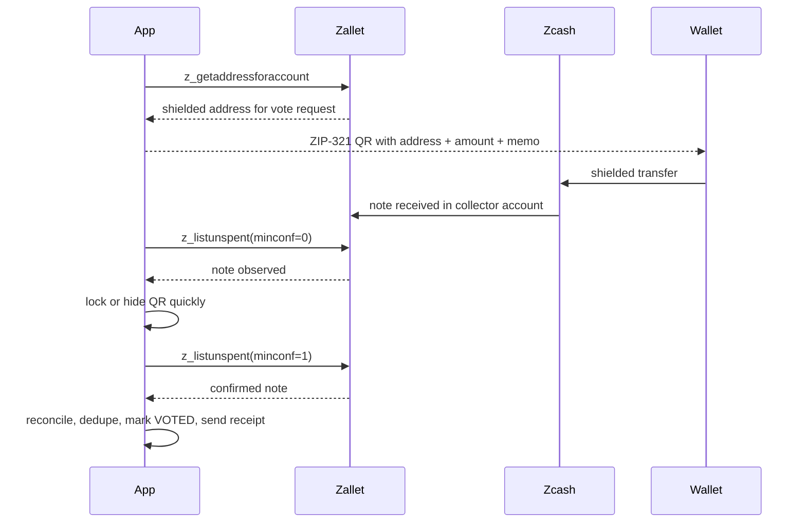

# Zcash Flow

This system uses Zcash as the transport rail for votes, not just as a payment reference.

## Calls used

- `z_sendmany`
  - submit the anchor transaction for a poll
- `z_getaddressforaccount`
  - allocate unique shielded addresses for vote requests
- `z_listunspent(minconf=0)`
  - detect incoming notes quickly and hide the QR
- `z_listunspent(minconf=1)`
  - confirm the note and finalize the vote receipt
- `z_getoperationstatus`
  - track async anchor completion

## Voting sequence

## Important behavior

- one vote request uses one unique shielded destination
- the voter sees one locked QR after confirming their choice
- duplicate sends from the same ticket are reconciled and ignored in the valid tally
- the public board uses reconciled results, not collector-raw counts
